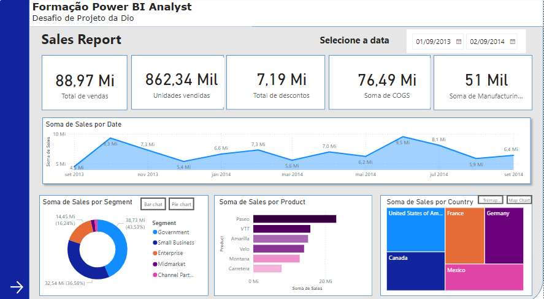

# Power-bi-Analyst---DIO

Criação de relatório Power BI

## Índice

- [Sobre](#sobre)
- [Tipo de Exercício](#tipo-de-exercício)
- [Local de Realização](#local-de-realização)
- [Minhas Impressões](#minhas-impressões)
- [Tecnologias Utilizadas](#tecnologias-utilizadas)
- [Aplicativo Utilizado](#aplicativo-utilizado)
- [Como Usar](#como-usar)
- [Contribuição](#contribuição)
- [Licença](#licença)

## Sobre

Desenvolvimento de um relatório elaborado utilizando o Power BI, baseado nos dados de exemplo "Sample Financials" fornecidos pelo Power BI.

## Tipo de Exercício

Projeto de análise de dados e visualização de informações com uso intensivo de Power BI.

## Local de Realização

Curso online oferecido pela plataforma Digital Innovation One (DIO).

## Minhas Impressões

Este exercício foi desafiador e muito enriquecedor. Aprendi a estruturar relatórios no Power BI, utilizar botões de navegação para melhor navegabilidade, aplicar segmentadores de dados, e publicar o relatório no Power BI Service. A experiência me proporcionou uma compreensão mais profunda das ferramentas de visualização de dados e da criação de relatórios interativos.

## Tecnologias Utilizadas

- Linguagens de Programação: DAX (Data Analysis Expressions)
- Ferramentas e Aplicativos: 
  - Power BI Desktop
  - Power BI Service
  - GitHub (para hospedar os arquivos de dados)

## Aplicativo Utilizado

- Power BI Desktop para a criação do relatório.
- Power BI Service para a publicação e compartilhamento do relatório.

## Como Usar

1. Baixe os arquivos de dados disponíveis no [GitHub](https://github.com/cibelemoraes/Power-bi-Analyst---DIO).
2. Abra o Power BI Desktop e importe os dados baixados.
3. Utilize a estrutura definida para criar o relatório.
4. Adicione botões de navegação para facilitar a navegabilidade.
5. Aplique segmentadores de dados e configure botões com imagens associadas.
6. Use indicadores e botões para selecionar diferentes visuais sobre um mesmo assunto.
7. Defina o layout do relatório utilizando objetos apropriados.
8. Crie gráficos e configure os campos necessários.
9. Adicione botões para melhorar a navegabilidade entre páginas do relatório.
10. Crie a segunda página do relatório.
11. Publique o relatório no Power BI Service.
12. Submeta o projeto através do link no GitHub.

## Contribuição

Para contribuir com o projeto, por favor, siga as seguintes etapas:

1. Fork o repositório.
2. Crie uma branch para sua feature (`git checkout -b feature/AmazingFeature`).
3. Commit suas mudanças (`git commit -m 'Add some AmazingFeature'`).
4. Push para a branch (`git push origin feature/AmazingFeature`).
5. Abra um Pull Request.

Relatório desenvolvido por Cibele Gomes Domingos Moraes .

